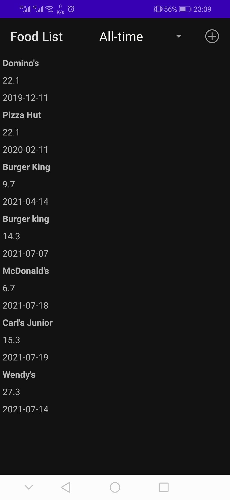
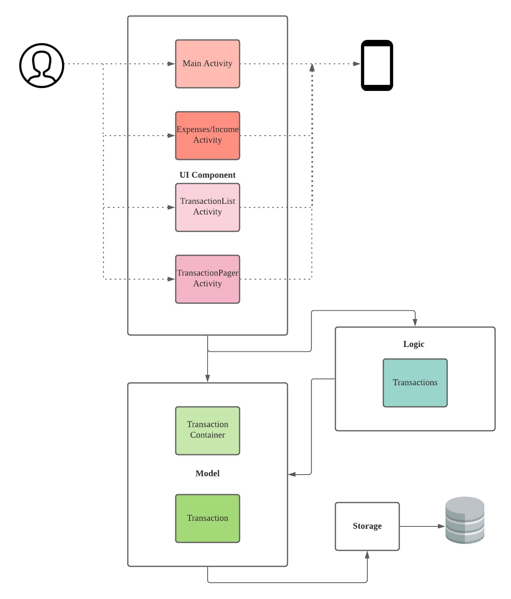
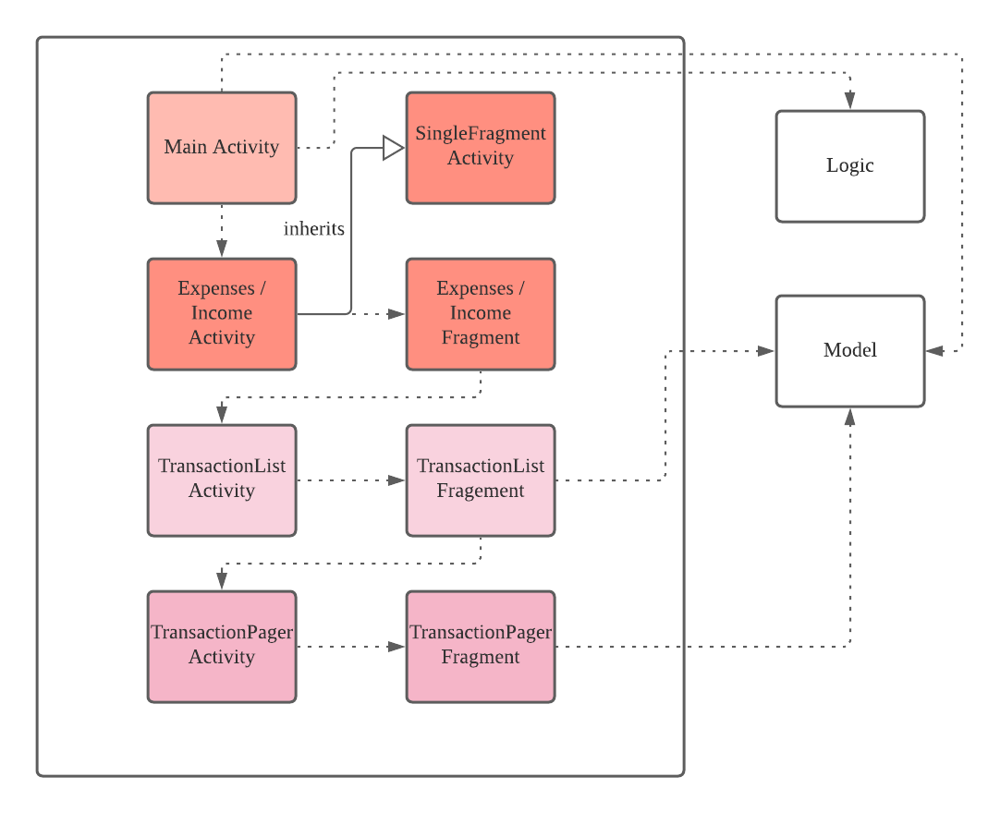
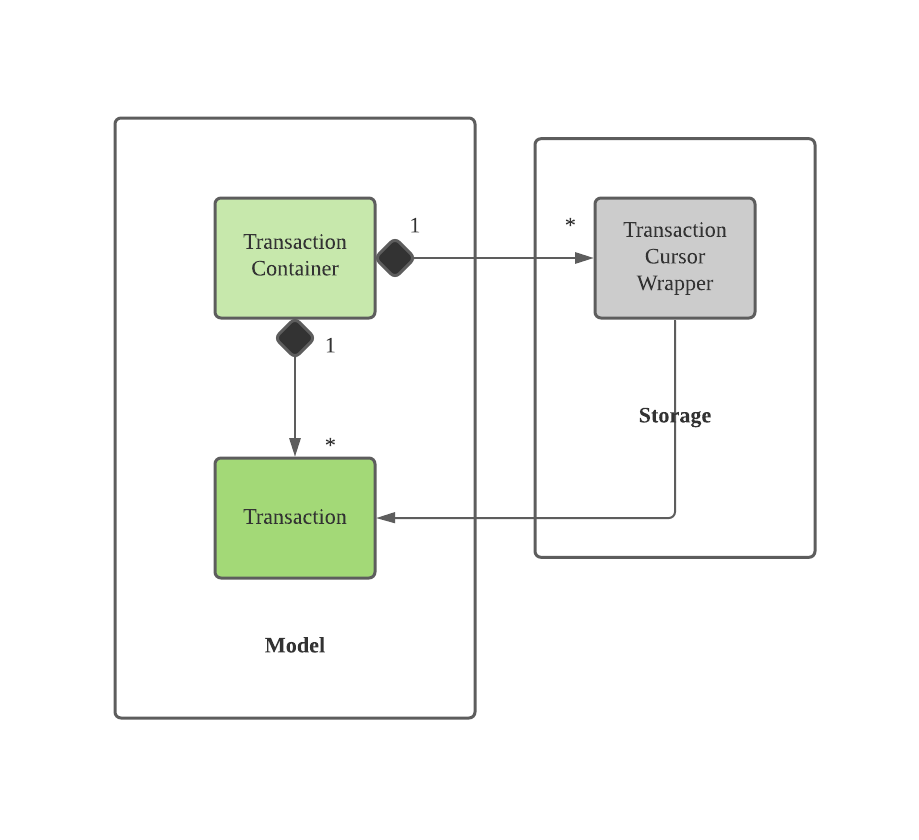
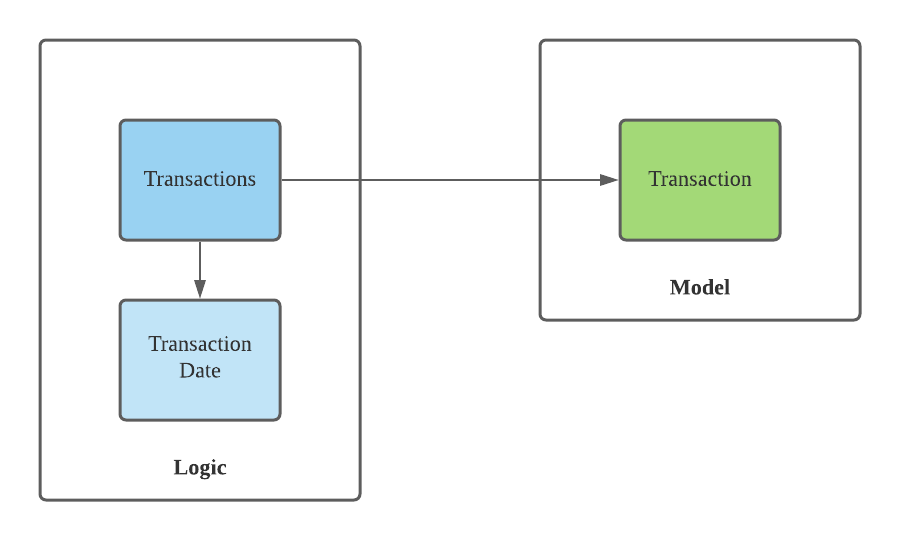
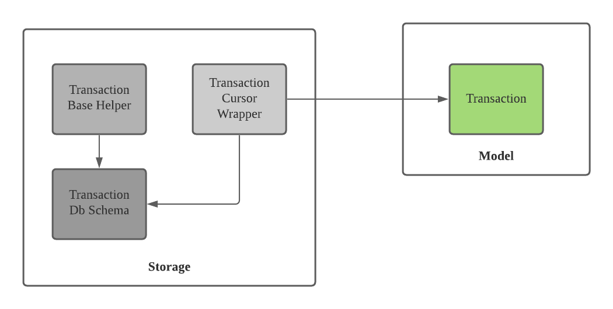

[<== Back to Home](https://github.com/Hemrish/Budget_Assistant#readme)

# Developer Guide

Budget Assistant is an android mobile application that will help keep track of your transactions in an organised manner. It will also set up visual aids to enable you to analyse your spending and income. 

This guide is for developers looking to modify the Budget Assistant. For users, please refer to the User Guide [here](UserGuide.md).

&nbsp;

----

## Table of Contents

* [How to Use This Guide](#how-to-use-this-guide)
    * [Icons & labels used in this guide](#icons--labels-used-in-this-guide)
* [Setting up Budget Assistant on Your Computer](#setting-up-budget-assistant-on-your-computer)
* [Introduction](#introduction)
    * [Background of Budget Assistant](#background-of-budget-assistant)
    * [Scope](#scope)
* [Design](#design)
    * [Architecture](#architecture)
    * [UI component](#ui-component)
    * [Model component](#model-component)
    * [Logic component](#logic-component)
    * [Storage component](#storage-component)
* [Appendix: Requirements](#appendix-requirements)
    * [Product Scope](#product-scope)
        * [Target user profile](#target-user-profile)
        * [Value proposition](#value-proposition)
    * [User Stories](#user-stories)
    * [Non-Functional Requirements](#non-functional-requirements)
* [Appendix: Instruction for Manual Testing](#appendix-instruction-for-manual-testing)

&nbsp;

----

## How to Use This Guide

#### Icons & labels used in this guide:

💡 - indicates a tip that may be useful to you. 
⚠ - indicates a warning that you should take note of. 

_Italic_ - Indicates that the content is a component. 
`Inline code` - Indicates that the content is a class, method or input by the user.

&nbsp;

[🡅 Back to Table of Contents](#table-of-contents)

----

## Setting up Budget Assistant on Your Computer

1. Fork [this repo](https://github.com/Hemrish/Budget_Assistant), and clone the fork into your computer.
1. Ensure you are using Java 11 or above.
1. Import the project into your IDE.

> 💡 You are highly recommended to use Android Studio.
.

&nbsp;

[🡅 Back to Table of Contents](#table-of-contents)

----

## Introduction

### Background of Budget Assistant

The Budget Assistant has a 4-layer system: Main Activity,Expenses Activity/Incomes Activity, TransactionList Activity(RecyclerView) and  TransactionPager Activity(ViewPager).

The following images will display the four layers respectively

    Figure 1 - Visualisation of Budget Assistant’s 4-layer system

### Scope

This document describes the software architecture and software design decisions for the implementation of the Budget Assistant. The intended audience of this document is the developers, designers, and software testers of this project.

&nbsp;

[🡅 Back to Table of Contents](#table-of-contents)

----

## Design

### Architecture

    
    
    Figure 2 - Budget Architecture Diagram

 The application consists of the following components:

* _UI_ : Displays graphical user interface and captures user input
* _Model_ : Contains data required by the application in memory
* _Logic_ : Manipulates and processes data for the UI
* _Storage_ : Handles loading and storing of data into an SQLite database 

&nbsp;

### UI Component

**API**: 

    
    
    Figure 3 - UI Component 

The layout of these UI parts is defined in matching .xml files that are in the src/main/res/layout. 
For example, the layout of the MainActivity is specified in activity_main.xml

&nbsp;

[🡅 Back to Table of Contents](#table-of-contents)

----

### Model Component

**API**: 

    
    
    Figure 4 - Model Component

💡 TransactionContainer is implemented as Singleton.

&nbsp;

[🡅 Back to Table of Contents](#table-of-contents)

----

### Logic Component

**API**: 

    
    
    Figure 5 - Logic Component

💡 Transactions is implemented as Singleton.

&nbsp;

[🡅 Back to Table of Contents](#table-of-contents)

----

### Storage Component

**API**: 

    
    
    Figure 5 - Storage Component

💡 SQLite library was made avail of.

&nbsp;

[🡅 Back to Table of Contents](#table-of-contents)

----
## Appendix: Requirements

### Product Scope

#### Target user profile:

1. Needs a consolidated and organised application to keep track of transactions
1. Uses android mobile phones
1. Needs to analyse spending and income trends

#### Value proposition:

Efficiently view and update regularly-needed information on transaction records.

&nbsp;

### User Stories

> 💡 Priority levels: 
> `1`: High (Must have) 
> `2`: Medium (Good to have) 
> `3`: Low (least likely to have)

| Priority | As a/an ... | I want to ... | So that I can ... |
| --- | --- | --- | --- |
| 1 | foodie | monitor how much I spend on food and groceries | be aware of what items I bought and consumed.  |
| 1 | avid traveller | keep track of all my travelling costs | I can better plan my journey in the future. |
| 1 | renter | know how much money I spend on rent and utilities | to control my electricity and water consumption |
| 1 | person who likes having fun | plan how much I spend on leisure and entertainment | avoid overspending. |
| 1 | student | record all my educational fees | know how much I spent on tuition fees, how much grant/bursary/scholarship I have been awarded and how much I spent on stationery. |
| 1 | employee | input my income | know how much money I receive |
| 1 | individual who takes care of oneself | record my medicines purchases and doctor fees | know how much I spent on health care. |
| 1 | individual who takes care of oneself | record my subscriptions and insurances | to avoid paying for services I no longer require. |
| 1 | individual who is dependent on his\her parent(s) | input my allowances | know how much money I have at a particular time. |
| 1 | outgoing person | be able to input money I spent on my friends or other donations | keep track of all my transactions. |
| 2 | meticulous person | view my savings | know how much money I saved. |
| 3 | meticulous person | I want to be able to monitor my transactions on a daily, weekly, monthly, yearly and all-time basis | analyse my expenditures when required. |
| 3 | meticulous person | I want to follow my transactions categorically or together | viewing my expenditures becomes neater and easier to understand.  |
| 3 | visual learner | visual aids such as graphs or charts to visualize my expenditures | better analyse my expenditure trends. |

&nbsp;

### Non-Functional Requirements

1. The device should function properly on any mobile device with at least an Android Oreo(Android 8.0.0 / API level 26)
1. The app should take at most 5 seconds to start and load subsequent frames
1. The graph should be easily interpreted and understood

&nbsp;

## Appendix: Instruction for Manual Testing

Due to the multi-layer system, logging, for all methods, has been added to facilitate manual testing.
There is a tag associated with each method. The tag refers to the class where the method has been implemented.
The tag name is the same as the class name. 

> 💡 Logging has also been added for branches.

[🡅 Back to Table of Contents](#table-of-contents)

----

